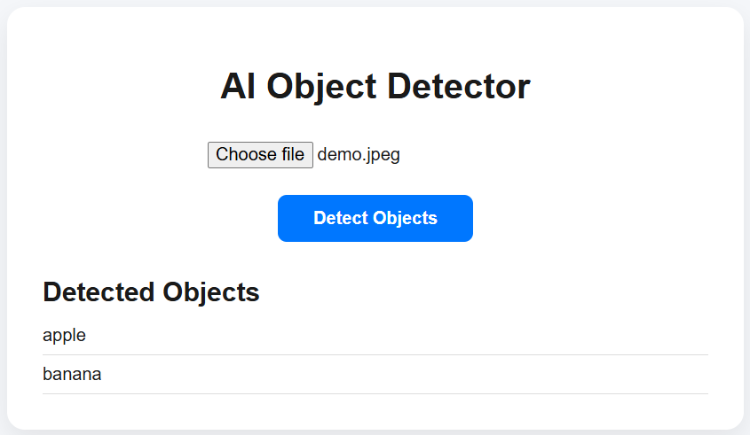

# 🧠 AI Object Detector

A full-stack object detection web application built using **React (frontend)** and **Django REST Framework with TensorFlow (backend)**. Users can upload images and get a list of detected objects using a pre-trained deep learning model.

## 📸 Features

- Upload any image from your device
- Detect objects using SSD MobileNet v2 trained on the COCO dataset
- Clean and intuitive UI
- Real-time results powered by TensorFlow Hub

---

## 🧰 Tech Stack

### 🔙 Backend
- Python  
- Django  
- Django REST Framework  
- TensorFlow + TensorFlow Hub  
- OpenCV  

### 🔜 Frontend
- React  
- Axios  
- CSS (custom styled UI)

---

## 🚀 Getting Started

### 1. Clone the repository
```bash
git clone https://github.com/jammudurgaprasad/Object_Detection.git
cd Object_Detection
```

---

## 🔧 Backend Setup (Django)
```bash
cd backend
python -m venv venv
source venv/bin/activate  # or venv\Scripts\activate on Windows
pip install -r requirements.txt
python manage.py migrate
python manage.py runserver
```

### Key API Endpoint

| Method | Endpoint         | Description             |
|--------|------------------|--------------------------|
| POST   | `/api/detect/`   | Detect objects in image |

---

## 🎨 Frontend Setup (React)
```bash
cd frontend
npm install
npm start
```

Make sure the backend is running at `http://localhost:8000` or update the Axios URL in `frontend/src/App.js` accordingly.

---

## 📦 Project Structure
```
project4/
├── backend/
│   ├── detection/           # Django app
│   ├── media/               # Uploaded images
│   ├── object_detection/    # Django project settings
│   ├── manage.py
│   └── requirements.txt
├── frontend/
│   ├── public/
│   ├── src/
│   └── package.json
└── runtime.txt              # For deployment platforms like Heroku
```

---

## 📷 Sample Use

1. Select an image to upload.
2. Click “Detect Objects”.
3. See results such as: `apple`, `person`, `car`, etc.

---

## 🖼️ Demo Input & Output

Here is an example input & output of the detection model:

<h3>Sample Input</h3>


<h3>Sample Output</h3>


---

## 🧠 Model Info

- **Model**: SSD MobileNet v2  
- **Source**: [TensorFlow Hub](https://tfhub.dev/tensorflow/ssd_mobilenet_v2/2)  
- **Dataset**: [COCO](https://cocodataset.org/#home)

---

## 🌍 Deployment

- Add your live URL to the frontend `App.js` where Axios posts the image.
- Backend includes `Procfile` and `runtime.txt` for Heroku deployment.

---

## 🤝 Contributions

Feel free to open issues or pull requests to improve the app.

---

## 📜 License

MIT License

---

## 👨‍💻 Author

[Jammu Durga Prasad](https://github.com/jammudurgaprasad)
